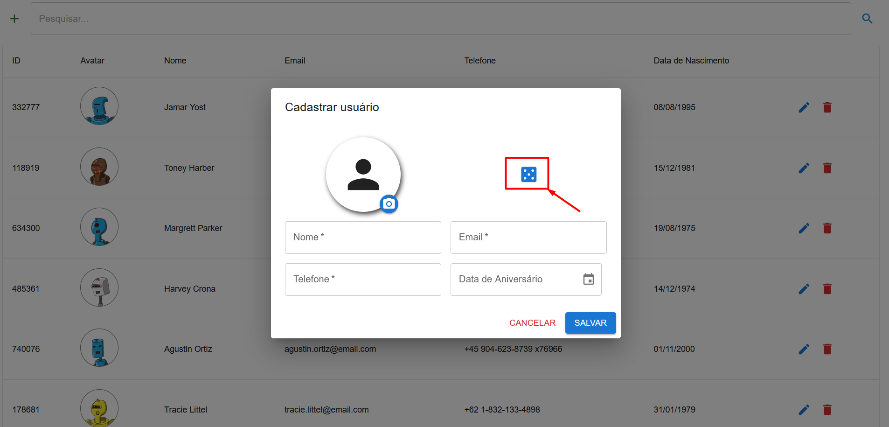

## CRUD com opção de gerar dados

## Backend

Para rodar o backend, é necessário apenas copiar o arquivo .env.example para o arquivo .env na raiz do projeto e então rodar o comando: `yarn start:dev`

## Frontend 

Para rodar o frontend, é necessário apenas copiar o arquivo .env.example para o arquivo .env na raiz do projeto e então rodar o comando: `yarn dev`

### Interface:

### Clique em adicionar usuário

### Clique em gerar usuário aleatório

### Usuário aleatório gerado com sucesso

